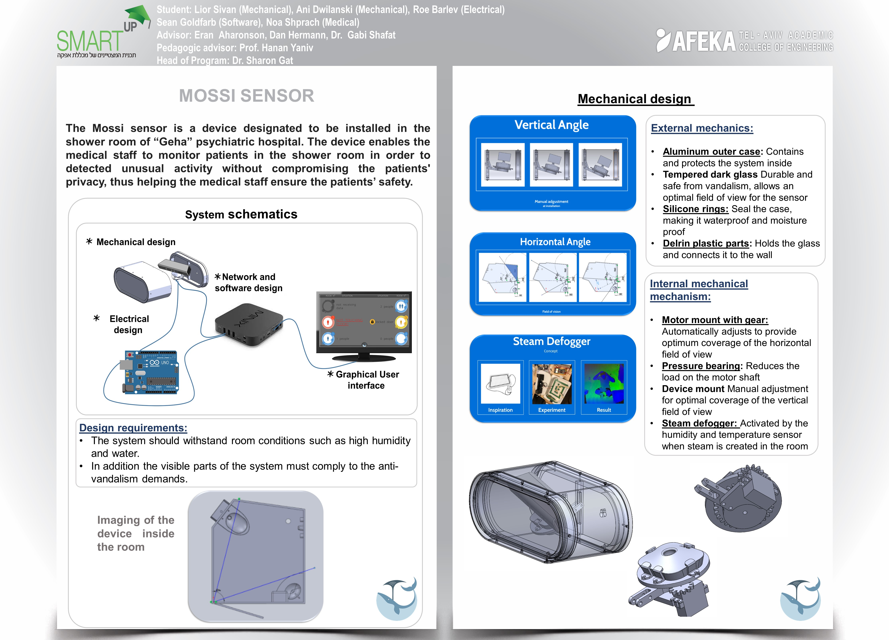
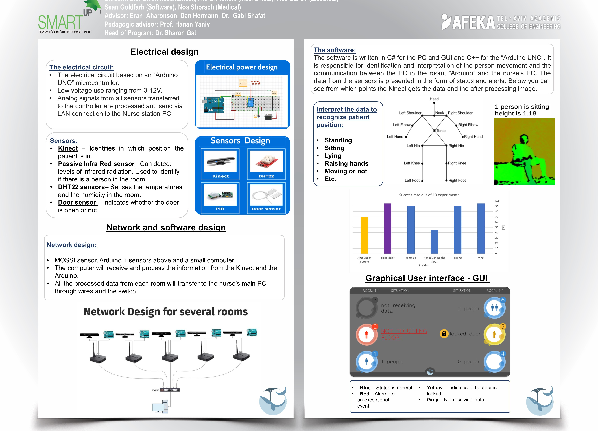

# SmartUp - Mossi Project
The project was designed for "Geha", a mental health center child and adolescent department. It's goal is to help recognize unusual patients activity that may refer to self harming and in some cases even suicide attempts. The system notifies to the medical staff for any unusual activity it detects. Because the project is designed for a child and adolescent department the whole process should be done without compromising the patients privacy.

## product poster

a short video explaining about the project in hebrew:

